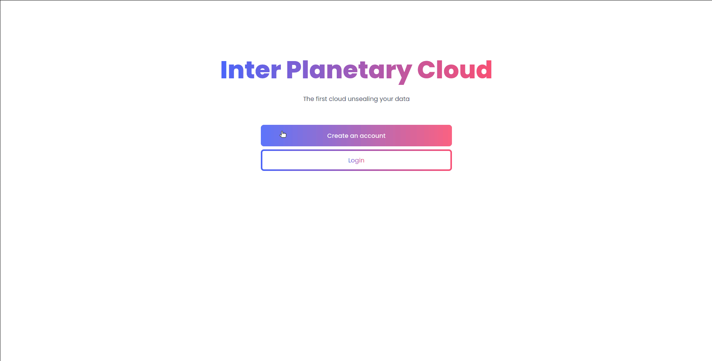
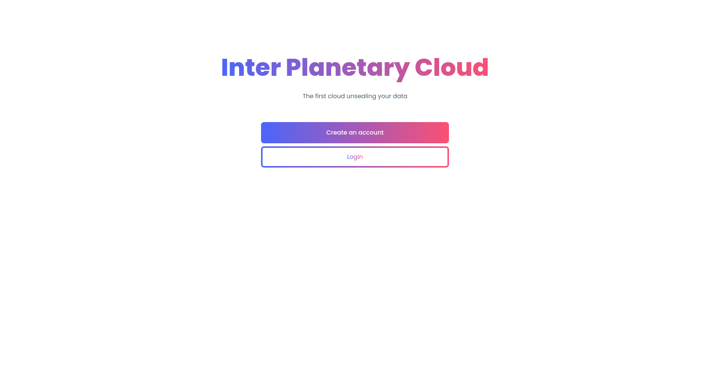
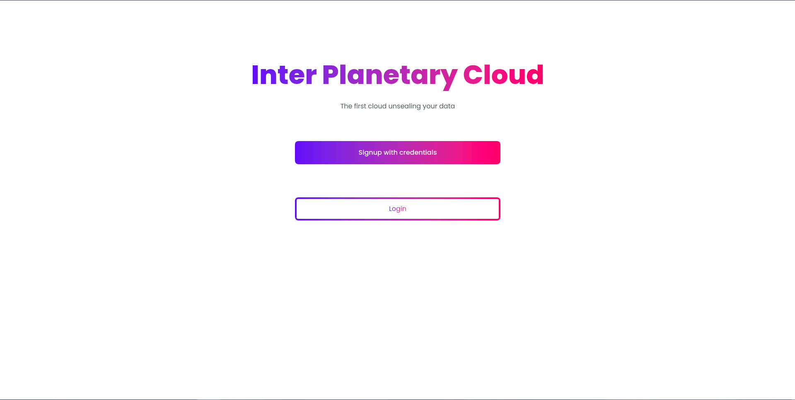
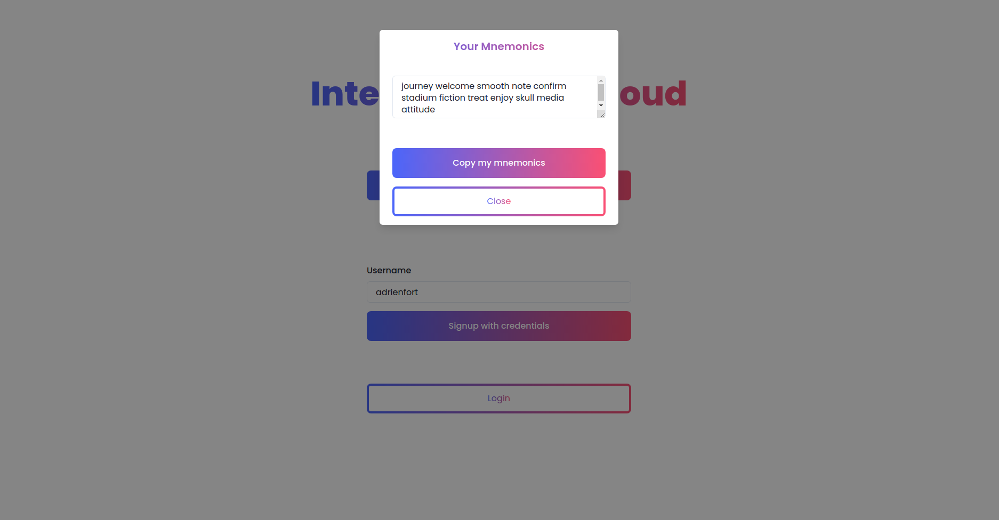
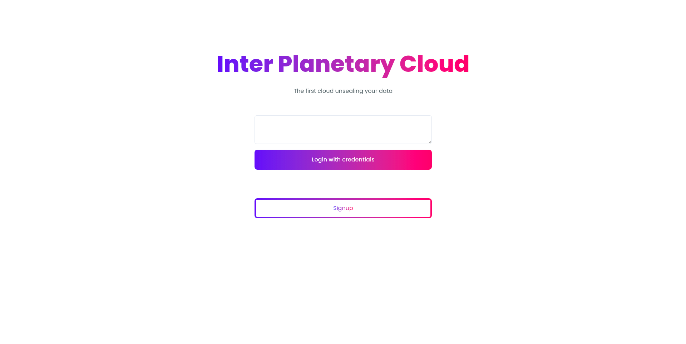
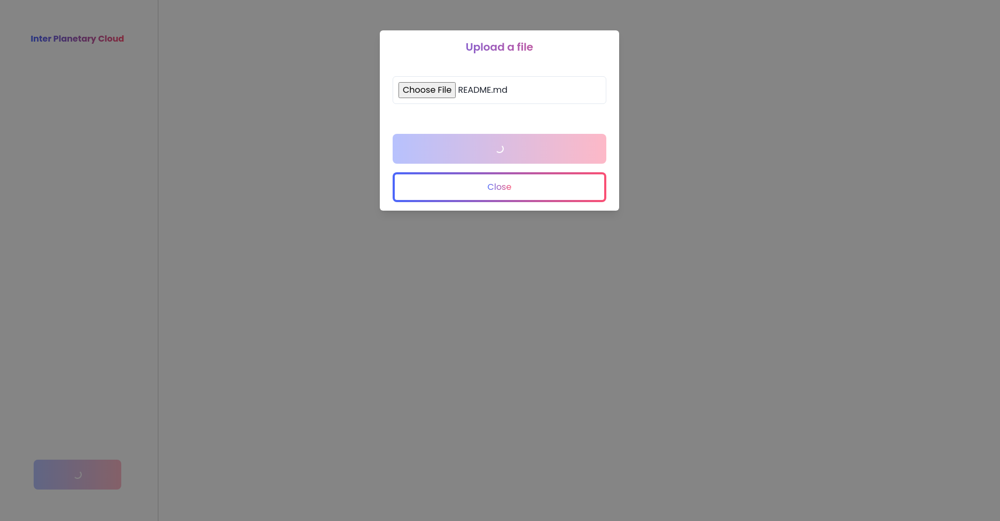

# InterPlanetaryCloud
A personal file storage and management system built on top of [IPFS](https://ipfs.io/), protecting your data.  

<div align="center">
  
 </div>

## Installation :wrench:

**1) Install Docker**  
Follow this [official guide](https://docs.docker.com/get-docker/) to install Docker.  
If you want to play a little bit with Docker, you can follow this [tutorial](https://docker-curriculum.com) or even our [workshop](https://github.com/PoCInnovation/Workshops/tree/master/software/04.Docker) !

**2) Install IPC**  
```
# Get the project
git clone git@github.com:PoCInnovation/InterPlanetaryCloud.git
cd InterPlanetaryCloud

# Build IPC docker image
docker build . -t ipc:latest
```

## Quickstart ⏩

**Run IPC :rocket:**  
```
# Run IPC docker image
docker run -p 3000:3000 ipc:latest
```
You are now ready to access to your decentralized cloud :boom: !

## Features :dizzy:
  
<details>
  <summary>Home Page</summary>
  
 

</details>

<details>
  <summary>Signup Page</summary>
  
 
 
</details>

<details>
  <summary>Signup Page - Mnemonics given</summary>
  
 
 
</details>

<details>
  <summary>Login Page</summary>
  
 
 
</details>

<details>
  <summary>Dashboard</summary>
  
 
 
</details>

<details>
  <summary>Dashboard - Upload document</summary>
  
 
 
</details>

## How ? :thinking:

**Technologies 🧑‍💻**
+ [React](https://reactjs.org/docs/getting-started.html)
+ [Typescript](https://www.typescriptlang.org/docs/handbook/typescript-in-5-minutes.html)
+ [Chakra UI](https://chakra-ui.com)

**Database :file_folder:**  
We use [Aleph SDK TS](https://github.com/aleph-im/aleph-sdk-ts#readme).

**Security 🛡️**  
Every file that you upload will be encrypted thanks to [crypto-js](https://www.npmjs.com/package/crypto-js).

## Our PoC team :ok_hand:

### March 2021 - September 2021
Developers:  
| [<br><sub>Adrien Fort</sub>](https://github.com/adrienfort) | [<br><sub>Diego Rojas</sub>](https://github.com/rojasdiegopro) | [<br><sub>Lorenzo Carneli</sub>](https://github.com/MrZalTy)
| :---: | :---: | :---: |

Project Managers:  
| [<br><sub>Adina Cazalens</sub>](https://github.com/NaadiQmmr) | [<br><sub>Luca Georges Francois</sub>](https://github.com/PtitLuca)
| :---: | :---: |

Reviewers :  
| [<br><sub>Tom Chauveau</sub>](https://github.com/TomChv)
| :---: |


### September 2021 - Today
Developers:  
| [<br><sub>Lucas Louis</sub>](https://github.com/lucas-louis) | [<br><sub>Matéo Viel</sub>](https://github.com/lolboysg)
| :---: | :---: |

Project Managers:  
| [<br><sub>Adrien Fort</sub>](https://github.com/adrienfort)
| :---: |

<h2 align=center>
Organization
</h2>

<p align='center'>
    <a href="https://www.linkedin.com/company/pocinnovation/mycompany/">
        
    </a>
    <a href="https://www.instagram.com/pocinnovation/">
        
    </a>
    <a href="https://twitter.com/PoCInnovation">
        
    </a>
    <a href="https://discord.com/invite/Yqq2ADGDS7">
        
    </a>
</p>
<p align=center>
    <a href="https://www.poc-innovation.fr/">
        
    </a>
</p>

> :rocket: Don't hesitate to follow us on our different networks, and put a star 🌟 on `PoC's` repositories
