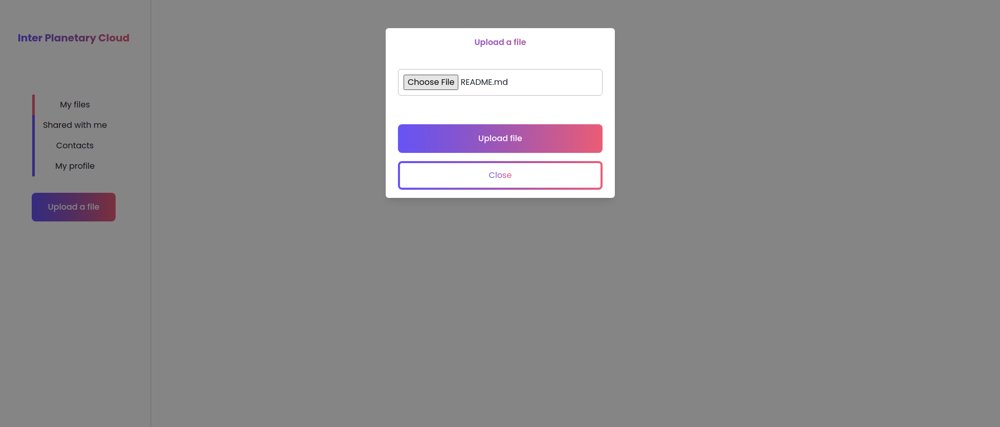
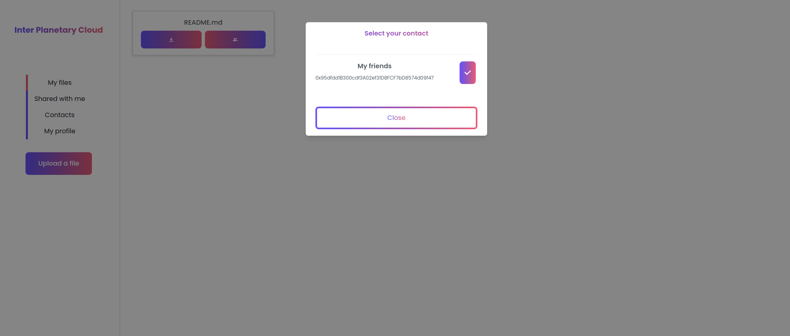
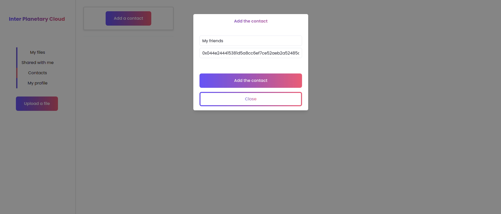
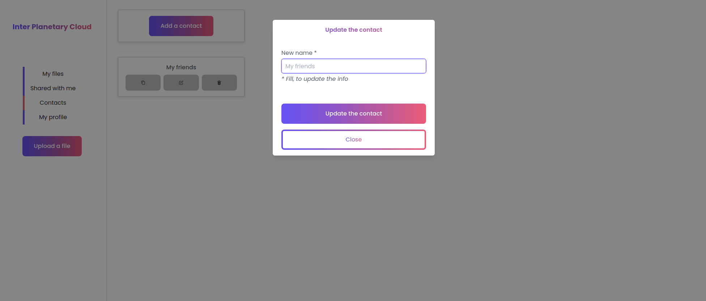
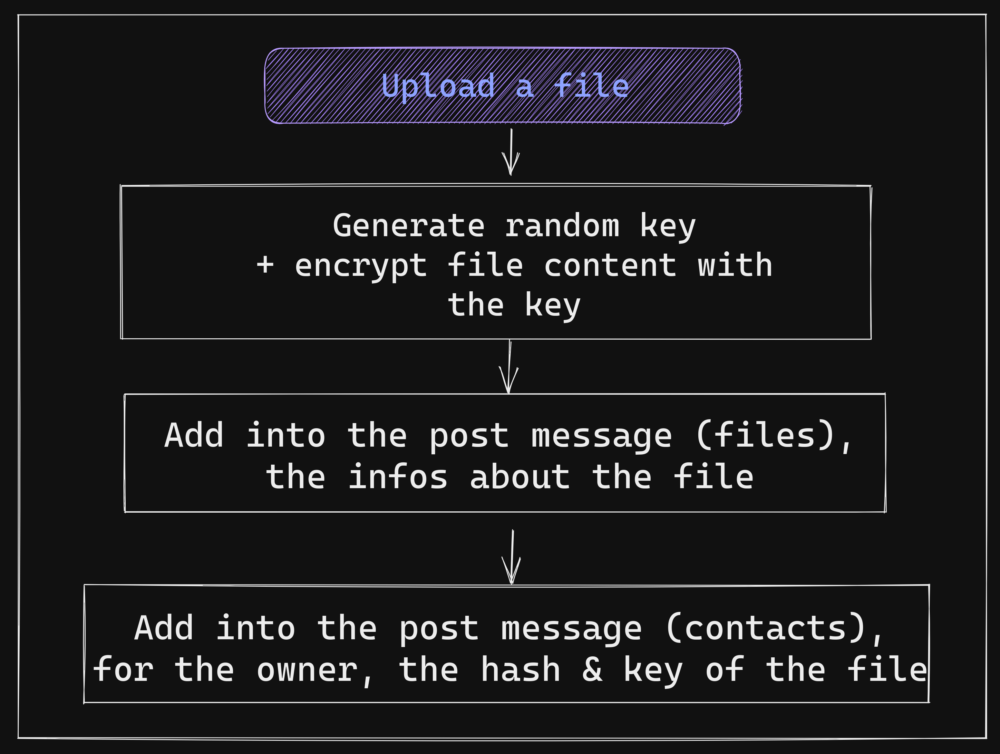
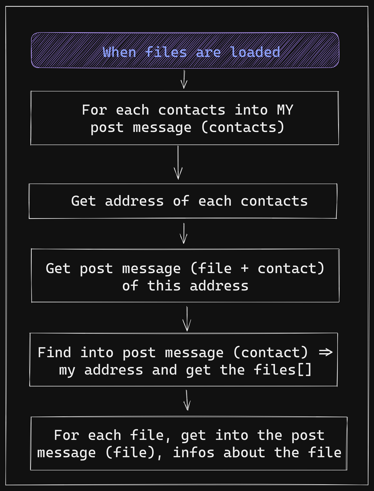
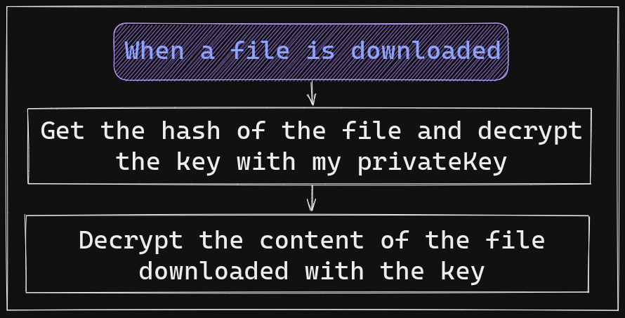
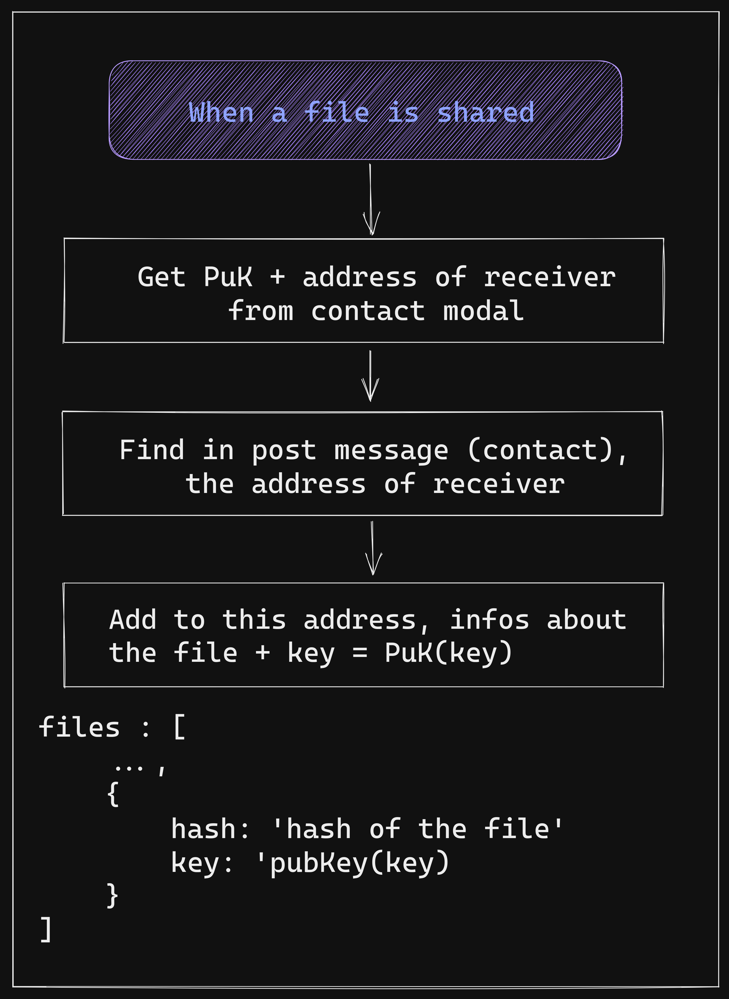
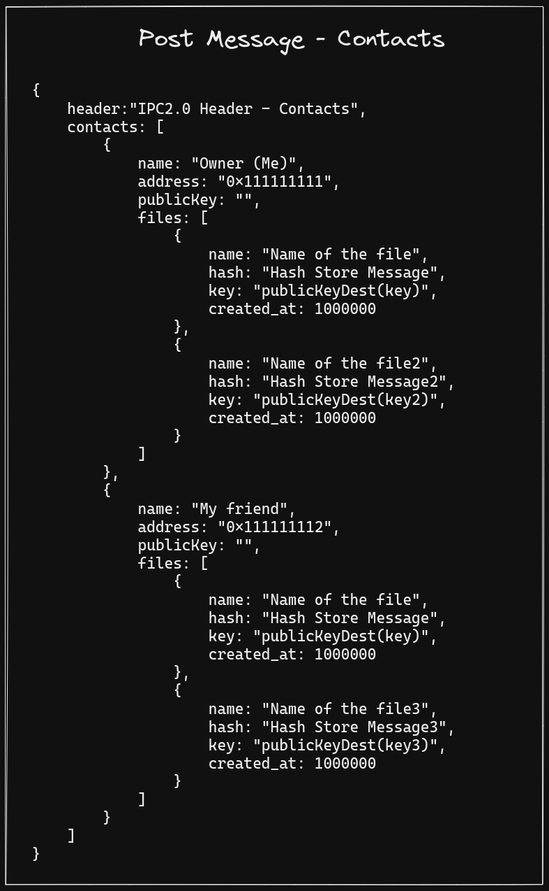

# InterPlanetaryCloud

InterPlanetaryCloud (IPC) is a distributed cloud built on top of [Aleph](https://aleph.im/#/), the next generation network of distributed big data applications.

IPC offers two services :

***Cloud Storage***

A distributed personal file storage and management system plateform, protecting your data.

<div align="center">
  
 </div>

***Cloud Computing***

A distributed personal cloud computing plateform for HTTP servers.

## Getting started :wrench:

### Installation

#### Install Docker

Follow this [official guide](https://docs.docker.com/get-docker/) to install Docker.\
If you want to play a little bit with Docker, you can follow this [tutorial](https://docker-curriculum.com) or even our [workshop](https://github.com/PoCInnovation/Workshops/tree/master/software/04.Docker) !

#### Install IPC

```
# Get the project
git clone git@github.com:PoCInnovation/InterPlanetaryCloud.git
cd InterPlanetaryCloud

# Build IPC docker image
docker build . -t ipc:latest
```

### Quickstart

#### Run IPC :rocket:

```
# Run IPC docker image
docker run -p 8080:80 ipc:latest
```

You are now ready to access to your decentralized cloud at [`http://localhost:8080`](http://localhost:8080) :boom: !

## Get involved

You're invited to join this project ! Check out the [contributing guide](./CONTRIBUTING.md).

If you're interested in how the project is organized at a higher level, please contact the current project manager.

## Features :dizzy:

<details>
  <summary>Home Page</summary>

 

</details>

<details>
  <summary>Signup Page</summary>

 

</details>

<details>
  <summary>Signup Page - Mnemonics given</summary>

 

</details>

<details>
  <summary>Login Page</summary>

 

</details>

<details>
  <summary>Dashboard</summary>

 

</details>

<details>
  <summary>Dashboard - Upload a file</summary>

 

</details>

<details>
  <summary>Dashboard - Share a file</summary>



</details>

<details>
  <summary>Dashboard - Files shared</summary>


</details>

<details>
  <summary>Dashboard - Contacts</summary>


</details>

<details>
  <summary>Dashboard - Add a contact</summary>



</details>

<details>
  <summary>Dashboard - Update a contact</summary>



</details>

<details>
  <summary>Dashboard - User's profile</summary>


</details>

## How does it work? :thinking:

### Technologies 🧑‍💻

- [Typescript](https://www.typescriptlang.org/docs/handbook/typescript-in-5-minutes.html)
- [React](https://reactjs.org/docs/getting-started.html)
- [Chakra UI](https://chakra-ui.com)

### Security 🛡️

Every file that you upload will be encrypted thanks to [crypto-js](https://www.npmjs.com/package/crypto-js).

### Database :file_folder:

We use [Aleph SDK TS](https://github.com/aleph-im/aleph-sdk-ts#readme).

<details>
  <summary>Full overview</summary>

  
</details>

---

- For each file, a random key is generated and the content of the file is encrypted with this key.
- The content is pushed into a store message via the aleph network.
- The hash of the store message and the key are added to the 'Contacts' post message.

<details>
    <summary>Upload a file</summary>



</details>

---

- For each contacts into the 'Post Message - Contacts', the files and contacts are get.
- An occurrence between the address of the user and the contacts is searched.
- For each file found, metadata about the files are retrieved.

<details>
    <summary>Load a file</summary>



</details>

---

- The content is retrieved from the aleph network from his hash.
- The content is decrypted with the key, itself decrypted with the private key of the user.

<details>
    <summary>Download a file</summary>



</details>

---

- The hash and the key are encrypted with the public key of the contact.
- These infos are added to the list of shared files of the contact.

<details>
    <summary>Share a file</summary>



</details>

---

- One post message, with the list of contacts and the list of shared files for each contacts
- The post message contains the info about the contact, his name, address, public key and a list of shared files

<details>
    <summary>Post messages</summary>

<div>

</div>

</details>

## Our PoC team :ok_hand:

### April 2022 - September 2022
Developpers - Team Storage:

| [<br><sub>Reza Rahemtola</sub>](https://github.com/RezaRahemtola) | [<br><sub>Tristan Masselot</sub>](https://github.com/TristanMasselot) | [<br><sub>Samoten 777</sub>](https://github.com/Samoten777)
|:---:|:---:|:---:|

Developpers - Team Computing:

| [<br><sub>Amoz Pay</sub>](https://github.com/AmozPay)| [<br><sub>Léo Dubosclard</sub>](https://github.com/ZerLock) | [<br><sub>Alex Prevot</sub>](https://github.com/Alex-Prevot)
|:---:|:---:|:---:|

Project Manager:
| [<br><sub>Adrien Fort</sub>](https://github.com/adrienfort)
| :---: |

Reviewers :
| [<br><sub>Lucas Louis</sub>](https://github.com/lucas-louis)
| :---: |

### September 2021 - April 2022
Developers:
| [<br><sub>Lucas Louis</sub>](https://github.com/lucas-louis) | [<br><sub>Matéo Viel</sub>](https://github.com/lolboysg)
| :---: | :---: |

Project Managers:
| [<br><sub>Adrien Fort</sub>](https://github.com/adrienfort)
| :---: |

### March 2021 - September 2021
Developers:
| [<br><sub>Adrien Fort</sub>](https://github.com/adrienfort) | [<br><sub>Diego Rojas</sub>](https://github.com/rojasdiegopro) | [<br><sub>Lorenzo Carneli</sub>](https://github.com/MrZalTy)
| :---: | :---: | :---: |

Project Managers:
| [<br><sub>Adina Cazalens</sub>](https://github.com/NaadiQmmr) | [<br><sub>Luca Georges Francois</sub>](https://github.com/PtitLuca)
| :---: | :---: |

Reviewers :
| [<br><sub>Tom Chauveau</sub>](https://github.com/TomChv)
| :---: |

<h2 align=center>
Organization
</h2>

<p align='center'>
    <a href="https://www.linkedin.com/company/pocinnovation/mycompany/">
        
    </a>
    <a href="https://www.instagram.com/pocinnovation/">
        
    </a>
    <a href="https://twitter.com/PoCInnovation">
        
    </a>
    <a href="https://discord.com/invite/Yqq2ADGDS7">
        
    </a>
</p>
<p align=center>
    <a href="https://www.poc-innovation.fr/">
        
    </a>
</p>

> :rocket: Don't hesitate to follow us on our different networks, and put a star 🌟 on `PoC's` repositories
