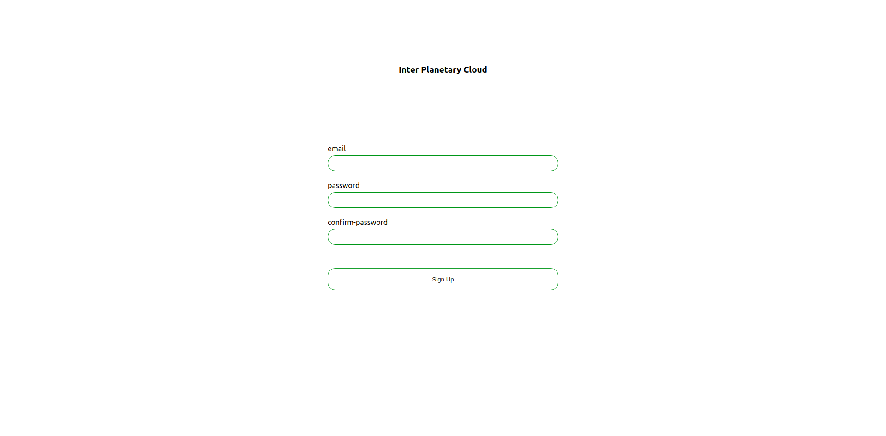

# InterPlanetaryCloud
A personal file storage and management system built on top of [IPFS](https://ipfs.io/), protecting your data.

## Table of contents
+ [Installation](#-installation)
+ [Features](#-features)
+ [How ?](#-how-?)
+ [Upcoming](#-upcoming)
+ [Contribute](#-contribute)
+ [Our PoC team](#-our-poc-team)

## Installation :wrench:

#### 1) Install IPFS
Follow this [guide](https://docs.ipfs.io/install/command-line/) and then run `ipfs init`.  
If you want to play a little bit with IPFS, you can follow this [tutorial](https://docs.ipfs.io/how-to/command-line-quick-start/).

#### 2) Install the project
```
git clone git@github.com:PoCInnovation/InterPlanetaryCloud.git
cd InterPlanetaryCloud
npm install
```
#### 3) Run the project :rocket:
In order to put your node online, run `ipfs daemon --enable-pubsub-experiment`.  
Then in another window, run `npm start`.  
You are now ready to access to your decentralized cloud :boom: !

## Features :dizzy:

#### Home Page


#### Signup Page


#### Login Page


#### Dashboard


## How ? :thinking:

#### Technologies 🧑‍💻
+ [Javascript](https://developer.mozilla.org/fr/docs/Learn/Getting_started_with_the_web/JavaScript_basics)
+ [React JS](https://reactjs.org/docs/getting-started.html)
+ [OrbitDB](https://github.com/orbitdb)
+ [IPFS](https://ipfs.io/)

#### Database :file_folder:
We use [OrbitDB](https://github.com/orbitdb).

 - [Key-Value](https://github.com/orbitdb/orbit-db/blob/master/API.md#orbitdbkeyvaluenameaddress) : email-docstore.address
 - [Docstore](https://github.com/orbitdb/orbit-db/blob/master/API.md#orbitdbdocsnameaddress-options) : one per user.

#### Security 🛡️
Your password is hashed with [bcrypt](https://www.npmjs.com/package/bcrypt).  
Every file that you upload will be encrypted thanks to [crypto-js](https://www.npmjs.com/package/crypto-js).

## Upcoming :new:
A new version in TypeScript, functionnal tests as well as a more user friendly dashboard (with the possibility to download) will be available soon !  
  


## Contribute 💛

We would be very happy to accept your PRs !  
> Fork the project, your remote repo on Github is called `origin`.  
> Create a new branch from `dev` if it exists, else from `master`.  
> Implement your feature, following our coding style.  
> Run tests if it exists.  
> Write tests.  
> Push your work and open a PR !  

Don't hesitate to open an issue !  
We hope our work pleased you 🍀

## Our [PoC](https://www.poc-innovation.fr/) team :ok_hand:
The Developers:
+ [Adrien Fort](https://github.com/adrienfort)
+ [Diego Rojas](https://github.com/rojasdiegopro)
+ [Lorenzo Carneli](https://github.com/MrZalTy)

The Manager:
+ [Luca Georges Francois](https://github.com/PtitLuca)

The Reviewer:
+ [Tom Chauveau](https://github.com/TomChv)
