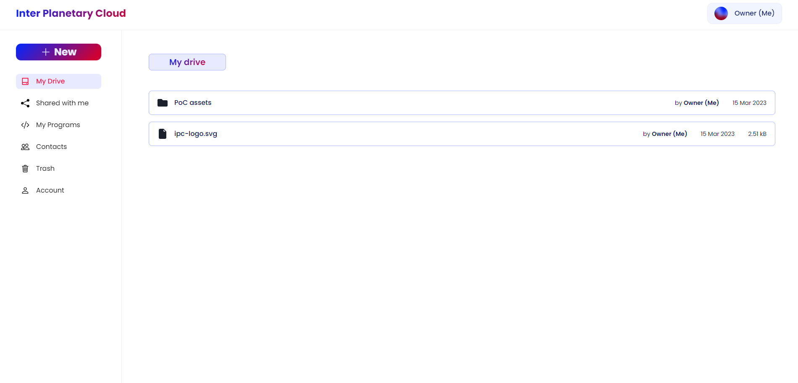

# InterPlanetaryCloud

InterPlanetaryCloud (IPC) is a distributed cloud built on top of [Aleph](https://aleph.im/#/), the next generation network of distributed big data applications.

<div>
  
</div>

IPC offers two services:

***Cloud Storage***

A distributed personal file storage and management system platform, protecting your data.

<br>

***Cloud Computing***

A distributed personal cloud computing platform for HTTP servers.

## Getting started 🔧

### Installation

#### Install Docker

Follow this [official guide](https://docs.docker.com/get-docker/) to install Docker, and [this one](https://docs.docker.com/compose/install/) to install Docker compose.\
If you want to play a little bit with Docker, you can follow this [tutorial](https://docker-curriculum.com) or even our [workshop](https://github.com/PoCInnovation/Workshops/tree/master/software/04.Docker)!

#### Install IPC

```sh
# Get the project
git clone git@github.com:PoCInnovation/InterPlanetaryCloud.git
cd InterPlanetaryCloud

# Build IPC docker image
docker compose build
```

### Quickstart

#### Run IPC 🚀

```sh
# Run IPC docker image
docker compose up
```

You are now ready to access to your decentralized cloud at [`http://localhost:3000`](http://localhost:3000) 💥

## Features 💫

### Cloud Storage



<details>
  <summary>Upload and use files</summary>
    <ul>
        <li>Once files are uploaded on IPC, they are not immutable!</li>
        <li>You can rename, modify the content or remove them as you want!</li>
    </ul>
</details>

<details>
  <summary>Create folders to organize your drive</summary>
    <ul>
        <li>Files are great, but virtual folders are also available on IPC to let you organize your files the way you want 🤩</li>
    </ul>
</details>

<details>
  <summary>Share your files (with access control)</summary>
    <ul>
        <li>Files can be shared among contacts with viewer or editor permissions, allowing for collaboration on your drive 🚀</li>
    </ul>
</details>

<details>
  <summary>Delete your files</summary>
    <ul>
        <li>Files can be put in the trash, and then deleted permanently :wastebasket:</li>
    </ul>
</details>

### Cloud Computing


<details>
  <summary>Upload and execute simple programs</summary>
    <ul>
        <li>
            Using Aleph VMs, programs listening on port <code>8080</code> can be executed if their source code has a size under 1 MB.<br>
            Large files should be attached in a secondary volume, which is not a feature implemented on our side... yet 😉
        </li>
        <li>
            The VMs support binary executables, shell scrips, NodeJS and Python ASGI programs.<br>
            For further information, here is the <a href="https://github.com/aleph-im/aleph-vm/blob/main/tutorials/README.md">official aleph documentation</a>.
        </li>
    </ul>
</details>

<details>
  <summary>Import programs from GitHub</summary>
    <ul>
        <li>Uploading programs compressed in an archive is great, but importing it directly from GitHub is way better 🚀</li>
        <li>
            GitHub OAuth was implemented in IPC to import public and private repositories.<br>
            ⚠️ This feature is only available when running IPC locally as it's using the filesystem to clone and zip the repository content ⚠️
        </li>
    </ul>
</details>
  

## How does it work? 🤔

### Technologies 🧑‍💻

- [Typescript](https://www.typescriptlang.org/docs/handbook/typescript-in-5-minutes.html)
- [React](https://reactjs.org/docs/getting-started.html) and [NextJS](https://nextjs.org/)
- [Chakra UI](https://chakra-ui.com)

### Security 🛡️

Every file that you upload will be encrypted thanks to [crypto-js](https://www.npmjs.com/package/crypto-js) and the encryption method of aleph from [eciesjs](https://www.npmjs.com/package/eciesjs).

### Database 📁

We use [Aleph SDK TS](https://github.com/aleph-im/aleph-sdk-ts#readme).

## Get involved

You're invited to join this project! Check out the [contributing guide](./CONTRIBUTING.md).

If you're interested in how the project is organized at a higher level, please contact the current project manager.


## Our PoC team 👌

### April 2023 - September 2023
Developers:
| [<br><sub>Charles Madjeri</sub>](https://github.com/charlesmadjeri) | [<br><sub>Abdallah Hammad</sub>](https://github.com/abdlastreet) | [<br><sub>Mohammed Jbilou</sub>](https://github.com/molaryy) | [<br><sub>Séphorah Aniambossou</sub>](https://github.com/sephorah)
|:---:|:---:|:---:|:---:|

Project Manager:

| [<br><sub>Reza Rahemtola</sub>](https://github.com/RezaRahemtola) |
|:---:|

### September 2022 - April 2023
Developers:

| [<br><sub>Florian Lauch</sub>](https://github.com/EdenComp) | [<br><sub>Lucas Louis</sub>](https://github.com/lucas-louis) | [<br><sub>Mehdi Djendar</sub>](https://github.com/SloWayyy) |
|:---:|:---:|:---:|

Project Manager:

| [<br><sub>Reza Rahemtola</sub>](https://github.com/RezaRahemtola) |
|:---:|

### April 2022 - September 2022
Developers - Team Storage:

| [<br><sub>Reza Rahemtola</sub>](https://github.com/RezaRahemtola) | [<br><sub>Tristan Masselot</sub>](https://github.com/TristanMasselot) | [<br><sub>Laure Gagner</sub>](https://github.com/Samoten777) |
|:---:|:---:|:---:|

Developers - Team Computing:

| [<br><sub>Amoz Pay</sub>](https://github.com/AmozPay) | [<br><sub>Léo Dubosclard</sub>](https://github.com/ZerLock) | [<br><sub>Alex Prevot</sub>](https://github.com/Alex-Prevot) |
|:---:|:---:|:---:|

Project Manager:

| [<br><sub>Adrien Fort</sub>](https://github.com/adrienfort) |
|:---:|

Reviewers:

| [<br><sub>Lucas Louis</sub>](https://github.com/lucas-louis) |
|:---:|

### September 2021 - April 2022
Developers:

| [<br><sub>Lucas Louis</sub>](https://github.com/lucas-louis) | [<br><sub>Matéo Viel</sub>](https://github.com/0xtekgrinder) |
|:---:|:---:|

Project Managers:

| [<br><sub>Adrien Fort</sub>](https://github.com/adrienfort) |
|:---:|

### March 2021 - September 2021
Developers:

| [<br><sub>Adrien Fort</sub>](https://github.com/adrienfort) | [<br><sub>Diego Rojas</sub>](https://github.com/rojas-diego) | [<br><sub>Lorenzo Carneli</sub>](https://github.com/MrZalTy) |
|:---:|:---:|:---:|

Project Managers:

| [<br><sub>Adina Cazalens</sub>](https://github.com/lambdina) | [<br><sub>Luca Georges Francois</sub>](https://github.com/0xpanoramix) |
|:---:|:---:|

Reviewers:

| [<br><sub>Tom Chauveau</sub>](https://github.com/TomChv) |
|:---:|

<h2 align=center>
Organization
</h2>

<p align=center>
    <a href="https://www.linkedin.com/company/pocinnovation/mycompany/">
        
    </a>
    <a href="https://www.instagram.com/pocinnovation/">
        
    </a>
    <a href="https://twitter.com/PoCInnovation">
        
    </a>
    <a href="https://discord.com/invite/Yqq2ADGDS7">
        
    </a>
</p>
<p align=center>
    <a href="https://www.poc-innovation.fr/">
        
    </a>
</p>

> 🚀 Don't hesitate to follow us on our different networks, and put a star 🌟 on `PoC's` repositories
